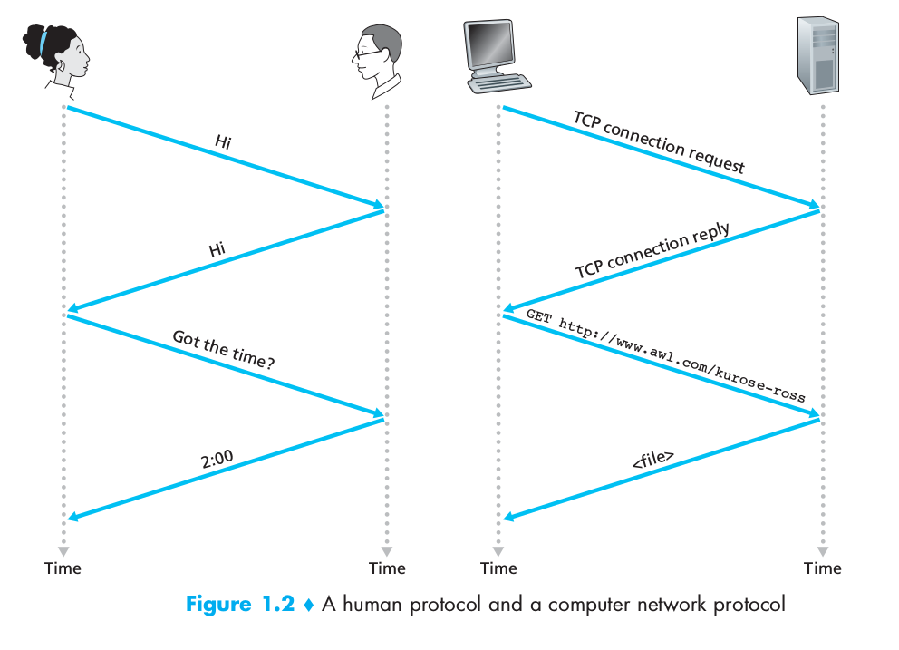

# Chapter 1: Computer Networks and the Internet

* Internet: 
    * computer network that interconnects hundreds of millions of computing devices throughout the world. These devices are called `hosts` or `end systems`. 
    * an insfrastucture that provides services to applications (`distributed applications`).
  
  

End systems are connected together by a network of `communication links` and `packet switches`. Different links can transmit data at different rates, with the `transmission rate` measured in bits/second. When one end system has data to send to another end system, the sending end system segments the data and adds header bytes to each segmente. The resulting packages of information, are called `packets`.

A packet switch (the two most prominent are `routers` and `link-layer switches`) takes a packet arriving on one of its incoming communication links and forwards that packet on one of its outgoing communication links.
* Link-layer switches: typically used in access networks.
* Routers: typically used in the network core.

The sequence of communication links and packet switches traversed by a packet from the sending end system to the receiving end system is known as a `route` or `path` through the network.

End systems access the Internet through `Internet Service Providers (ISPs)`. End systems, packet switches, and other pieces of the Internet run `protocols` that control the sending and receiving of information within the Internet. The `Transmission Control Protocol (TCP)` and the `Internet Protocol (IP)` are two of the most important protocols in the Internet.

`Internet standars` are developed by the `Internet Engineering Task Force (IETF)`. The IETF standards documents are called `request for comments (RFC's)`. They define protocols such as TCP, IP, HTTP and SMTP (Simple Mail Transfer Protocol => for e-mail).

End systems attached to the Internet provide an `Application Programming Interface (API)` that specifies how a program running on one end system asks the Internet infrastucture to deliver data to a specific destination program running on another end system.

* `Protocol`: defines the format and the order of messages exchanged between two or more communicating entities, as well as the actions taken on the transmission and/or receipt of a message or other event.

