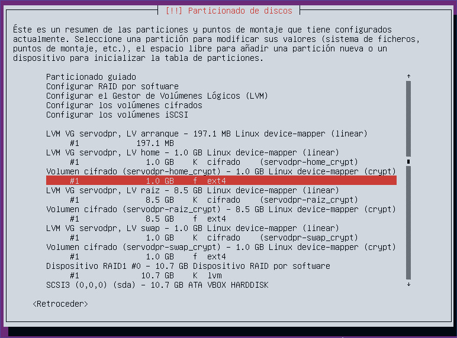
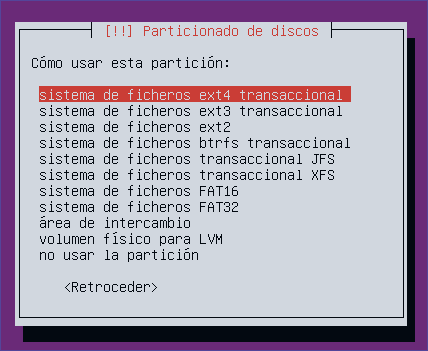
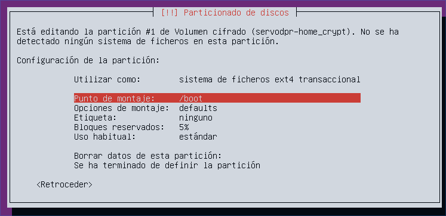
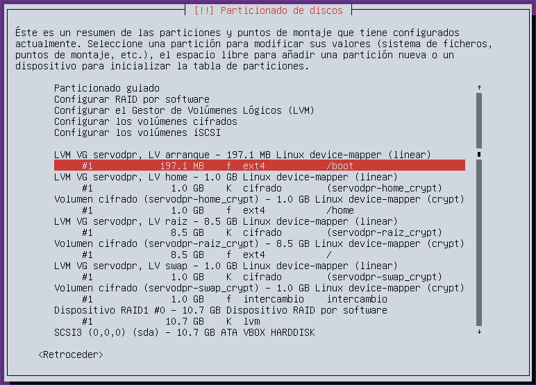
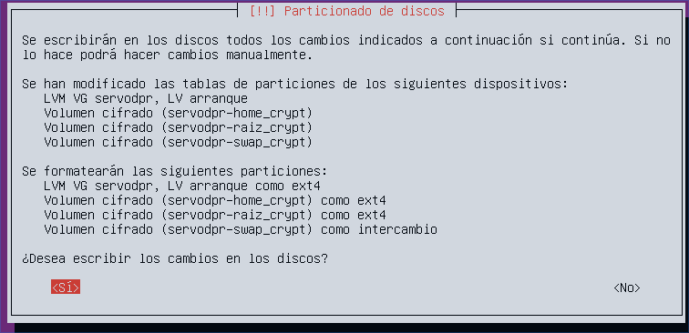
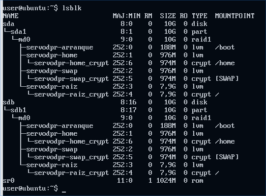
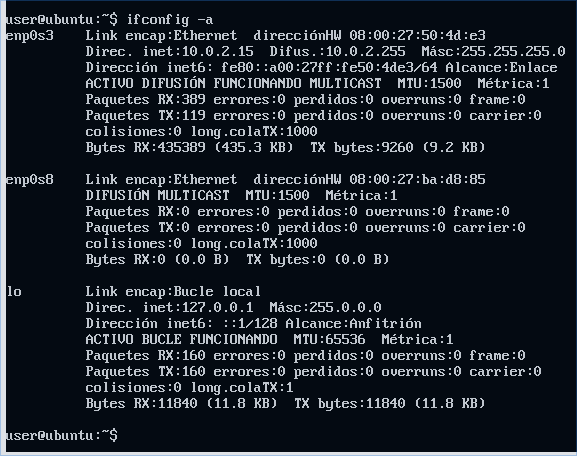

# Práctica 0

## Sesión 1 (Ubuntu)

### Parte 1: Configuración de VM y de los discos

1. Descargar las siguientes imágenes:

```
http://atcproyectos.ugr.es/esriie/ubuntu-16.04.5-server-amd64.iso
http://atcproyectos.ugr.es/esriie/CentOS-7-x86_64-Minimal-1611.iso
```

2. Definir una nueva máquina virtual en Virtual Box

   - Nombre: ubuise1.
   - Tipo: Linux.
   - Versión: Ubuntu 64 bits.
   - Lo demás por defecto (darle siempre a Next, a lo del disco duro también)

3. Click derecho sobre la máquina virtual -> Settings -> Storage.

   1. Primero añadimos la ISO de Ubuntu: (botoncico del cd) .
   2. Luego pulsamos _Choose disk_ y seleccionamos la ISO de Ubuntu que nos hemos descargado.
   3. Opcionalmente podemos borrar el disco donde pone _Empty_.
   4. Ahora tenemos que crear un nuevo disco (botón de la derecha): 
   5. Luego le damos a crear _Create new disk_ y lo dejamos todo por defecto (nombre _ubuise2_, para que sea más reconocible después).

4. Encedemos la máquina virtual y seguimos las instrucciones:

   - El espacio sirve para pinchar sobres las opciones.
   - **NO** cifrar nuestra carpeta personal
   - Usuario: user. Password: practicaISE.
   - Particionado -> **Manual**.
   - Ahora te aparecerán dos discos, algo así:

   

   - Te metes en cada uno de ellos y le das a que sí cuando te pregunte si quieres crear la tabla de particiones. Te debería quedar así:

   

   - Le damos a _Configuración del RAID por software_
   - Le damos a que sí cuando nos pregunta si queremos escribir los cambios en disco.
   - Cuando llegemos a aquí, seleccionamos la opción _Crear un dispositivo MD_.

   

   - Seleccionamos _RAID 1_ => Número de dispositivos del RAID: _2_ => Número de dispositivos libres para el RAID: _0_.
   - Seleccionamos los dos discos para el RAID (con barra espaciadora y luego ENTER)

   

   - Guardamos los cambios y le damos a _Terminar_ =>

5. Ahora le damos a _Configurar el sistema de volúmenes lógicos_ => Le damos a que _sí_ queremos mantener las particiones => Crear grupo de volúmenes => Le ponemos de nombre _servidor_:

   

   Seleccionamos ese disco con barra espaciadora y le damos a enter y luego a que sí.

6. Ahora vamos a crear 4 volúmenes lógicos:

   - le damos a _Crear volumen lógico_ => elegimos _servidor_ => nombre: _arranque_ tamaño: _200MB_
   - Ahora repetimos estos pasos tres veces con estos datos:
     - Nombre: _home_ Tamaño: _1024MB_
     - Nombre: _swap_ Tamaño: _1024MB_
     - Nombre: _raiz_ Tamaño: lo que quede

   Al final le das a _Terminar_ y te tiene que quedar esta pantalla:

   

7. Ahora le damos a _Configurar volúmenes cifrados_ => a que sí => _Created encrypted volumes_ => seleccionas _home_, _raiz_ e _intercambio_ **EL DE ARRANQUE NO** => Ahora le das a _Se ha terminado de definir la partición_ (3 veces, una por cada volumen) => guardas cambios y le das a _Finish_ => Pones 3 contraseñas (pon la misma que luego se te olvida).

8. Ahora le das a enter sobre lo que están en rojo (fíjate bien que ponga home, importante):






En punto de montaje le damos y seleccionamos _/boot_.



Y ya estaría chicos luego le damos a _Se ha terminado de definir la partición_.

Ahora hay que repetir esto para los otros tres _Volumen cifrado (lo que sea aqui)_, seleccionando las mismas opciones, pero en punto de montaje seleccionamos _/_ o _/home_. Para el swap, no hace falta seleccionar punto de montaje, porque en la opción _Utiliar como_ hay que seleccionar _área de intercambio_. Si lo has hecho bien debería quedarte algo así:



9. Halah, baja hasta abajo y selecciona _Finalizar el particionado y escribir los cambios en disco_, aceptar y a rezar. Algo así debería aparecer:



### Parte 2: Instalación del sistema y configuración de red

1. Lo que sale del proxy déjalo en blanco, dale a enter solo. Actualizaciones automáticas tampoco. También dejar en blanco lo de programas a instalar, excepto el _standard system utilities_ que viene por defecto marcado.

2. Te esperas un buen ratico a que termine e instalas el cargador de arranque en _sda_. Luego le das a todo a que sí y demases y pones las contraseñas de tu cifrado.

3. Inicias sesión con tus datos y puedes ejecutar `lsblk` para ver un listado de los bloques, algo así debería aparecer:



Si no sale así bueno, cuando termines de llorar porque te has equivocado, vuelve a arriba y comienza esta épica aventura de nuevo.

4. Ahora poner `sudo bash` y luego `grub-install /dev/sdb` para instalar el cargador de arranque en `sdb`.

5. Ejecuta `ifconfig` y donde pone `enp0s3` es donde aparece la información sobre nuestra interfaz de red virtual. Con `lspci | grep Ether` podemos localizar dicha interfaz. Y con `cat /etc/network/interfaces` podemos ver el contenido del archivo donde vamos a definir nuevas interfaces.

6. Apagamos la máquina ejecutando el comando `poweroff`.

7. Arriba a la izquierda le das a `File` -> `Host Network Manager` -> Iconico verde de crear -> Acuerdate del nombre de la interfaz, seguramente será: _vboxnet0_


8. Le damos a _Esc_ para quitar la ventana que ha aparecido antes. Luego pinchamos sobre la máquina virtual y le damos a Settings, y configuramos como aparece en la foto:


Y encedemos la máquina virtual again. Si todo ha saido bien al ejecutar `ifconfig -a` debería salirte:



9. Ahora ejecutamos todo esto:

```
sudo bash
cp /etc/network/interfaces /etc/network/interfaces.bk (copia de seguridad por si la pifiamos)
lspci | grep Ethernet
nano /etc/network/interfaces
```

Y al final de eso escribimos:


Luego ejecutamos:

```
ifup enp0s8
ifconfig (tenemos que ver que enp0s8 está configurada)
```

Si ahora ejecutamos `ping 192.168.57.105` y funciona, es que lo has hecho bien :D. (esta red no tiene acceso a Internet).

Y esto es todo, aquí termina la sesión 1 (no borres la máquina virtual).

## Sesión 2 (CentOS)
