# Práctica 1

## Sesión 1 (Ubuntu)

### Parte 1: Configuración de la VM y de los discos

1. Descargar las siguientes imágenes:

```
http://atcproyectos.ugr.es/esriie/ubuntu-16.04.5-server-amd64.iso
http://atcproyectos.ugr.es/esriie/CentOS-7-x86_64-Minimal-1611.iso
```

2. Definir una nueva máquina virtual en Virtual Box

   - Nombre: ubuise1.
   - Tipo: Linux.
   - Versión: Ubuntu 64 bits.
   - Lo demás por defecto (darle siempre a Next, a lo del disco duro también)

3. Click derecho sobre la máquina virtual -> Settings -> Storage.

   1. Primero añadimos la ISO de Ubuntu: (botoncico del cd) .
   2. Luego pulsamos _Choose disk_ y seleccionamos la ISO de Ubuntu que nos hemos descargado.
   3. Opcionalmente podemos borrar el disco donde pone _Empty_.
   4. Ahora tenemos que crear un nuevo disco (botón de la derecha): 
   5. Luego le damos a crear _Create new disk_ y lo dejamos todo por defecto (nombre _ubuise2_, para que sea más reconocible después).

4. Encedemos la máquina virtual y seguimos las instrucciones:

   - El espacio sirve para pinchar sobre las opciones.
   - **NO** cifrar nuestra carpeta personal
   - Usuario: user. Password: practicaISE.
   - Particionado -> **Manual**.
   - Ahora te aparecerán dos discos, algo así:

   

   - Te metes en cada uno de ellos y le das a que sí cuando te pregunte si quieres crear la tabla de particiones. Te debería quedar así:

   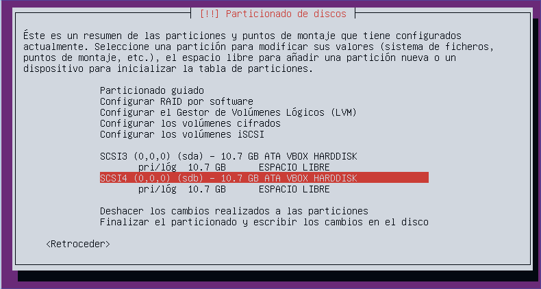

   - Le damos a _Configurar RAID por software_
   - Le damos a que sí cuando nos pregunta si queremos escribir los cambios en disco.
   - Cuando llegemos a aquí, seleccionamos la opción _Crear un dispositivo MD_.

   

   - Seleccionamos _RAID 1_ => Número de dispositivos del RAID: _2_ => Número de dispositivos libres para el RAID: _0_.
   - Seleccionamos los dos discos para el RAID (con barra espaciadora y luego ENTER)

   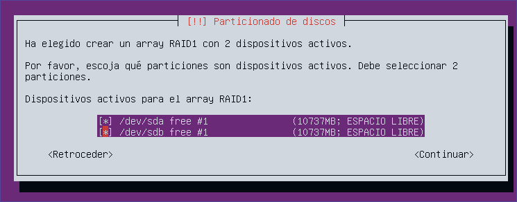

   - Guardamos los cambios y le damos a _Terminar_

5. Ahora le damos a _Configurar el sistema de volúmenes lógicos_ => Le damos a que _sí_ queremos mantener las particiones => Crear grupo de volúmenes => Le ponemos de nombre _servidor_:

   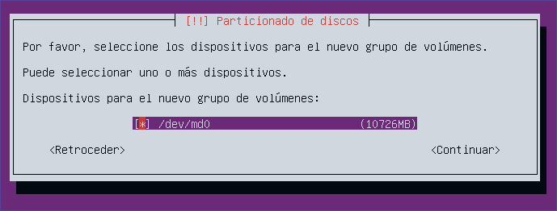

   Seleccionamos ese disco con barra espaciadora y le damos a enter y luego a que sí.

6. Ahora vamos a crear 4 volúmenes lógicos:

   - le damos a _Crear volumen lógico_ => elegimos _servidor_ => nombre: _arranque_ tamaño: _200MB_
   - Ahora repetimos estos pasos tres veces con estos datos:
     - Nombre: _home_ Tamaño: _1024MB_
     - Nombre: _swap_ Tamaño: _1024MB_
     - Nombre: _raiz_ Tamaño: lo que quede

   Al final le das a _Terminar_ y te tiene que quedar esta pantalla:

   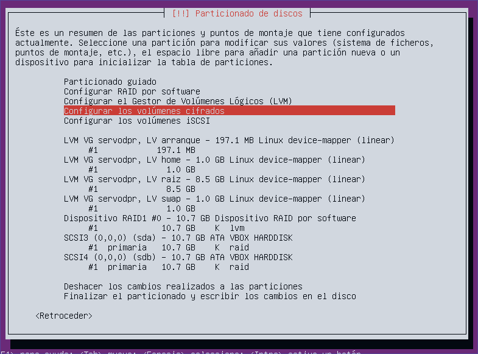

7. Ahora le damos a _Configurar volúmenes cifrados_ => a que sí => _Created encrypted volumes_ => seleccionas _home_, _raiz_ e _intercambio_ **EL DE ARRANQUE NO** => Ahora le das a _Se ha terminado de definir la partición_ (3 veces, una por cada volumen) => guardas cambios y le das a _Finish_ => Pones 3 contraseñas (pon la misma que luego se te olvida).

8. Ahora le das a enter sobre lo que están en rojo (fíjate bien que ponga home, importante):


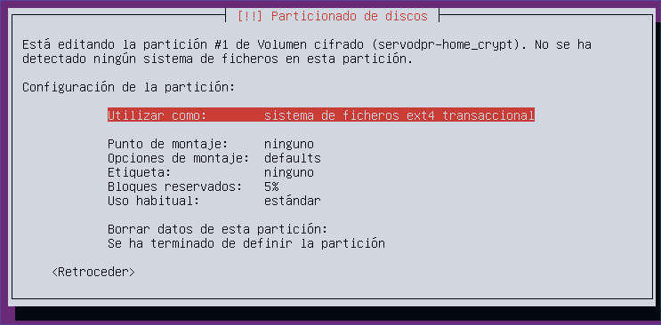


En punto de montaje le damos y seleccionamos _/boot_.


Y ya estaría chicos luego le damos a _Se ha terminado de definir la partición_.

Ahora hay que repetir esto para los otros tres _Volumen cifrado (lo que sea aqui)_, seleccionando las mismas opciones, pero en punto de montaje seleccionamos _/_ o _/home_. Para el swap, no hace falta seleccionar punto de montaje, porque en la opción _Utilizar como_ hay que seleccionar _área de intercambio_. Si lo has hecho bien debería quedarte algo así:


9. Halah, baja hasta abajo y selecciona _Finalizar el particionado y escribir los cambios en disco_, aceptar y a rezar. Algo así debería aparecer:


### Parte 2: Instalación del sistema y configuración de red

1. Lo que sale del proxy déjalo en blanco, dale a enter solo. Actualizaciones automáticas tampoco. También dejar en blanco lo de programas a instalar, excepto el _standard system utilities_ que viene por defecto marcado.

2. Te esperas un buen ratico a que termine e instalas el cargador de arranque en _sda_. Luego le das a todo a que sí y demases y pones las contraseñas de tu cifrado.

3. Inicias sesión con tus datos y puedes ejecutar `lsblk` para ver un listado de las particiones, algo así debería aparecer:


Si no sale así bueno, cuando termines de llorar porque te has equivocado, vuelve a arriba y comienza esta épica aventura de nuevo.

4. Ahora poner `sudo bash` y luego `grub-install /dev/sdb` para instalar el cargador de arranque en `sdb`.

5. Ejecuta `ifconfig` y donde pone `enp0s3` es donde aparece la información sobre nuestra interfaz de red virtual. Con `lspci | grep Ether` podemos localizar dicha interfaz. Y con `cat /etc/network/interfaces` podemos ver el contenido del archivo donde vamos a definir nuevas interfaces.

6. Apagamos la máquina ejecutando el comando `poweroff`.

7. Arriba a la izquierda le das a `File` -> `Host Network Manager` -> Iconico verde de crear -> Acuerdate del nombre de la interfaz, seguramente será: _vboxnet0_


8. Le damos a _Esc_ para quitar la ventana que ha aparecido antes. Luego pinchamos sobre la máquina virtual y le damos a Settings, y configuramos como aparece en la foto:


Y encendemos la máquina virtual again. Si todo ha ido bien al ejecutar `ifconfig -a` debería salirte:


9. Ahora ejecutamos todo esto:

```
sudo bash
cp /etc/network/interfaces /etc/network/interfaces.bk (copia de seguridad por si la pifiamos)
lspci | grep Ethernet
nano /etc/network/interfaces
```

Y al final de eso escribimos:


Luego ejecutamos:

```
ifup enp0s8
ifconfig (tenemos que ver que enp0s8 está configurada)
```

Si ahora ejecutamos `ping 192.168.57.105` y funciona, es que lo has hecho bien :D. (esta red no tiene acceso a Internet).

Y esto es todo, aquí termina la sesión 1 (no borres la máquina virtual).

## Sesión 2 (CentOS)

### Parte 1: configuración de los discos

1. Definir una nueva máquina virtual en Virtual Box

   - Nombre: ubuise2.
   - Tipo: Linux.
   - Versión: Red Hat 64 bits.
   - Lo demás por defecto (darle siempre a Next, a lo del disco duro también)

2. Click derecho sobre la máquina virtual -> Settings -> Storage.

   1. Primero añadimos la ISO de CentOS: (botoncico del cd).
   2. Luego pulsamos _Choose disk_ y seleccionamos la ISO de CentOS que nos hemos descargado.
   3. Opcionalmente podemos borrar el disco donde pone _Empty_.
   4. Encedemos la máquina.

3. Instalar, idioma en inglés. Vemos que _Instalation destination_ sale en rojo, eso es porque hay que configurarlo, clickamos sobre él. Y ahora le damos a _Done_ (sin tocar nada antes) que está arriba a la izquierda y luego a _Begin installation_.

   1. **IMPORTANTE:** pon el teclado en español, si no las vas a pasar canutas buscando donde están las teclas.

4. Le ponemos contraseña al usuario _root_ y creamos un usuario para nosotros y cuando se termine de instalar reiniciamos la máquina.

5. Iniciamos sesión como root y ejecutamos `lsblk` para ver las particiones y saldrán las que hace CentOS por defecto. `df -h` muestra el sistema de archivos montados en el sistema y su tamaño. Debería salir esto:

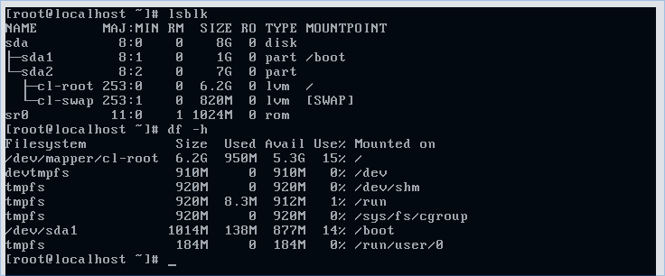

6. Creación de un nuevo disco duro:

   1. `poweroff`
   2. Settings => Storage => SATA => Add disk (como antes vaya, todo por defecto)
   3. Iniciamos la máquina y nos logeamos como root.
   4. Si ejecutamos `lsblk` deberíamos ver el nuevo disco creado.

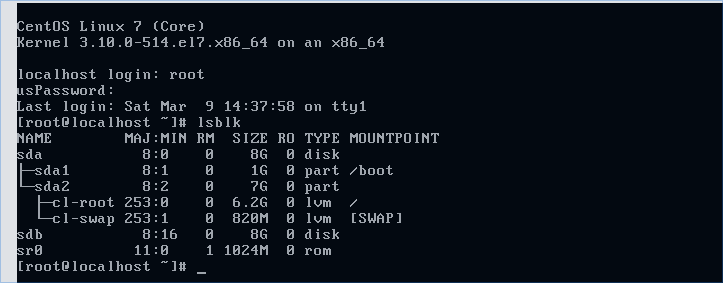

7. Configuración del _sdb_:

   1. `pvdisplay` => muestra los volúmenes físicos configurados (PV => phisical volume (/dev/sda2), VG => volume group (cl)).
   2. `lvmdiskscan` => ver unidades de disco y cómo de gestionan en VM.
   3. `pvcreate /dev/sdb`
   4. `pvdisplay` => debería aparecer esto:

      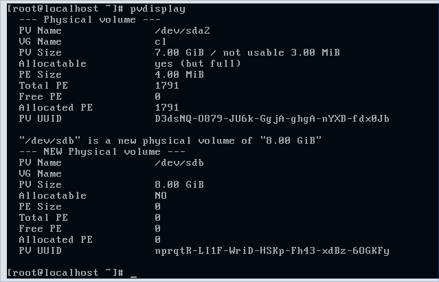

   5. `vgs` => información de volúmenos también.
   6. `vgextend cl /dev/sdb` => para extender el grupo de volúmenes
   7. `vgs` => ahora debería aparecer PV a 2 y en `vgdisplay` ActPV a 2.
   8. `lvdisplay` => para ver los volúmenes configurados
   9. `lvdisplay | more root` (o swap)

8. Creación de un volumen lógico:

   1. `lvcreate -L 4G -n newvar cl`
   2. `lvdisplay | more`
   3. `mkfs -t ext4 /dev/cl/newvar`
   4. `lsblk` (debería aparecer un newvar colgando por ahí, pero sin punto de montaje)
   5. `df -h`

9. Vamos a cambiar el var a newvar:

   1. Arrancamos CentOS en runlevel 1: `systemctl isolate runlevel1.target`
   2. `cd /` (muy **importante**)
   3. `systemctl status` => deberíamos ver _maintenance_ en naranjilla o así.
   4. `mkdir /mnt/vartemp`
   5. `mount /dev/cl/newvar /mnt/vartemp`
   6. `df -h` => en la última línea saldrá _newvar_ montado en _vartemp_
   7. `cp -a /var/* /mnt/vartemp` => copiar conservando metadatos, contexto y recursivamente)
   8. `ls -l /mnt/vartemp` => veremos que está todo lo que antes estaba en var
   9. `mv /var /oldvar` => ya la ruta de _/var_ como tal no existe, está todo movido y los datos en _newvar_.

10. Hacer que los nuevos datos de _newvar_ se pasen a _var_ y que ya sea el definitivo.

    1. mkdir var
    2. cat /etc/fstab
    3. cp /etc/fstab /etc/fstab.bk (copia de seguridad)
    4. nano /etc/fstab (a mi nano no me servia asi que use vi => i para escribir, luego :wq + enter para guardar)

    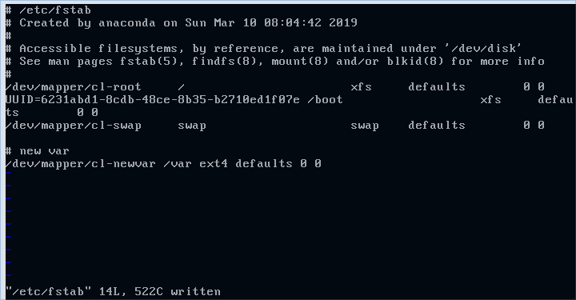

    1. `umount /mnt/vartemp`
    2. `mount -a`
    3. `lbslk`
    4. `blkid` (para ver las ids)
    5. `vgs` => Debería aparecer algo como esto

    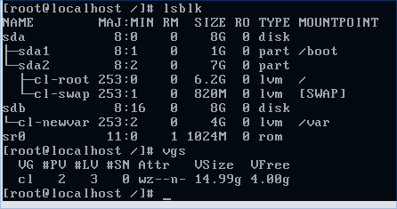

11. Ahora vamos a extender (el tamaño) del volumen lógico `newvar`:

    1. `lvresize -L +2G /dev/mapper/cl-newvar` => **Importante** el signo `+`, que si no lo que hace es cambiarle el tamaño a 2G en lugar de ampliarlo.
    2. `lsblk` => debería aparecer el tamaño cambiado (6G)
    3. `df -h` => aquí aparecerá que su tamaño es 4G
    4. Para actualizar ese valor, ejecutar: `resize2fs /dev/mapper/cl-newvar`

    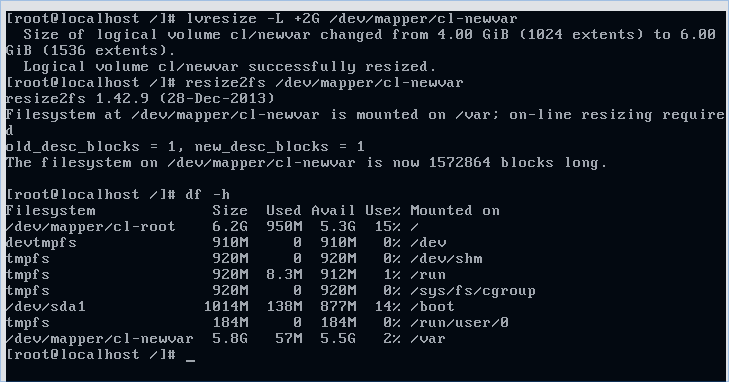

    5. `reboot` y luego `lsblk`, `df -h`, `ls -la /var` para ver los cambios hechos.

### Parte 2: configuración de red

1. Vamos a configurar una NAT:

   1. `ipaddr` => muestra las interfaces de red (parecido a `ifconfig`)
   2. `cd /etc/sysconfig/network-scripts`
   3. `ls` => veremos los ficheros que se usan para configurar la red
   4. `cat ifcfg-enp0s3` => ver info de esa NAT (`enp0s3`)
   5. `vi ifcfg-enp0s3` y al final del todo cambiamos `ONBOOT=NO` por `ONBOOT=yes` => para que la NAT se activa cuando encendamos la máquina.
   6. `ip addr` => la veremos sin configurar
   7. `ifup ifcfg-enp0s3` => para que se configure
   8. `ip addr` => ya debería aparecer configurada
   9. `poweroff`

2. Como en la sesión anterior, `Settings` -> `Network` -> `Adapter 2` -> `Enable network adapter` -> `host only` -> Iniciar la máquina virtual.

3. `ip addr` => Debería aparecer un adaptador nuevo
4. `cd /etc/sysconfig/network-scripts`
5. `cp ifcfg-enp0s3 ifcfg-enp0s8`
6. `vi ifcfg-enp0s8` y dejarlo como en la siguiente captura:

   

7. `ifup ifcfg-enp0s8` => también está el equivalente `ifdown` que es para desactivar la NAT.
8. Para ver si lo has hecho bien puedes hacer `reboot` y luego `ping 192.168.57.118`: si sale que se mandan paquetitos está todo correcto y ya puedes mandar a esta práctica a tomar viento :).

**IMPORTANTE**: en el examen pueden preguntar qué hacen los comandos que han aparecido aquí, así que estaría bien buscarlo. Además no borres las máquinas virtuales porque puede pedirte que se la enseñes y te haga preguntas.

## Sesión 3 (CentOS + LUKS)

### Parte 1

- Objetivo: mover el directorio /var de antes a un RAID1, por lo que vamos a tener que añadir dos discos mas y vamos a cifrarlo con `luks`. Por lo que primero vamos a hacer una snapshot de la maquina de CentOS (buscarlo en las opciones y darle a take) para guardar el estado de la máquina virtual de la sesión anterior.

1. Añadimos dos discos (CentosR1D1 y CentosR1D2) como antes.
2. arrancamos la máquina virtual y comprobamos con `lsblk` que aparecen dos nuevos discos.
3. las utilidades del raid 1 se llaman mdadm (muldi disk administration): `yum install mdadm`
4. `mdadm --create /dev/md0 --level=1 --raid-devices=2 /dev/sdc /dev/sdd` => comando para crear una raid1. Lanzará una advertencia porque al crear un raid de esta forma no podremos arrancar el sistema desde el RAID creado. `lsblk` para ver el RAID.

### Parte 2 (muy parecido a la Sesión 2)

- Observación: si añadimos a un mismo grupo de volúmenes un disco sin raid y otros con raid el problema que tenemos es que no sabremos si los datos irán al raid o no, ya que lo gestiona lvm.

1. `pvcreate /dev/md0` y `pvdisplay`
2. `vgcreate raid1 /dev/mod0` y `vgdisplay`
3. `lvcreate -L +7G -n rvar raid1` y `vgdisplay`
4. `mkfs -t xfs /dev/raid1/rvar`
5. `mkdir /mnt/nvar`
6. `mount /dev/raid1/rvar /mnt/nvar`
7. `systemctl isolate runlevel1.target`
8. `cp -a /var/* /mnt/nvar/` y `cd /` y `cp -a /var /oldvar`
9. Ahora tenemos que editar el fichero `/etc/fstab`. Sustituimos la ultima linea por: `/dev/raid1/rvar /var xfs defaults 0 0`
10. `umount /mnt/nvar` y `mount -a` y `reboot`
11. `lvremove /dev/cl/newvar` y `vgdisplay`
12. `lvextend -L +6G /dev/cl/root` y `df -h`
13. `xfs_growfs /dev/cl/root`

### Parte 3: Encryptación

1. `yum install crypsetup`
2. `systemctl isolate runlevel1.target` y `cd`
3. `rm -rf var && cd / && cp -a var oldvar && umount /var`
4. `cryptsetup luksFormat /dev/raid1/rvar` y `lsblk`
5. `cryptsetup luksOpen /dev/mapper/raid1-rvar raid1-rvar-crypt` y `lsblk`
6. `mkfs -t xfs /dev/mapper/raid1-rvar-crypt`
7. `mount /dev/mapper/raid1-rvar-crypt /mnt/nvar`
8. `cp -a /oldvar/* /mnt/nvar`

El fichero /etc/crypttab nos permitirá descifrar el disco cunado arranque el SO. Necesitamos el identificador del volumen donde vamos a hacerlo, podemos obtenerlo con el comando `blkid` => `blkid : grep crypto > /etc/cryptattab`

1. `vi /etc/cryptab` => raid1-rvar-crypt UUID=ewfwefew none (importante quitar las comillas)
2. `vi /etc/fstab` => cambiamos la ultima lina por: `/dev/mapper/raid1-rvar-crypt /var xfs defaults 0 0`
3. `umount /mnt/nvar` y `mount -a`
4. `reboot`
