# Seminario I: Programación multihebra y semáforos.

#### Creación de hebras:

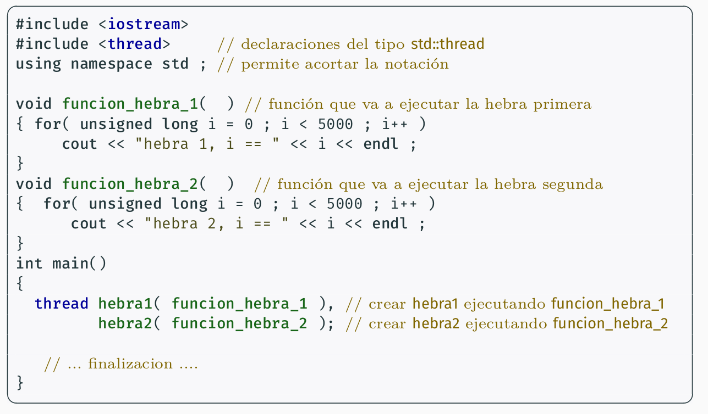

Este ejemplo produce un error por finalización incorrecta.

También se podrían haber declarado de la siguiente forma:

Para compilar con la línea de órdenes:

O cada uno por separado:

#### Mecanismo de sincronización: join

Este ejemplo sí se ejecuta correctamente.

* Método `joinable`:
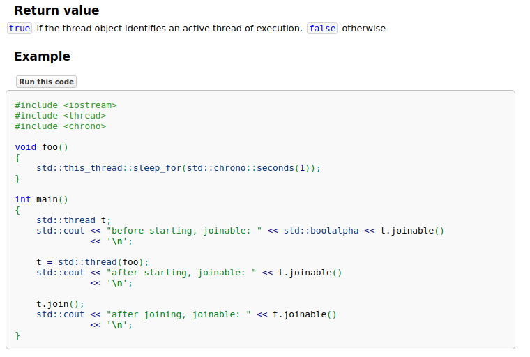

#### Paso de parámetros a hebras:

#### Obtención de variables resultado:

##### Uso de variables globales
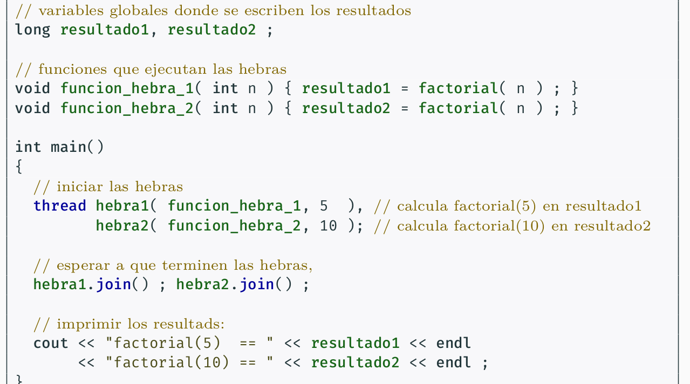

##### Uso de un parámetro de salida (referencia)

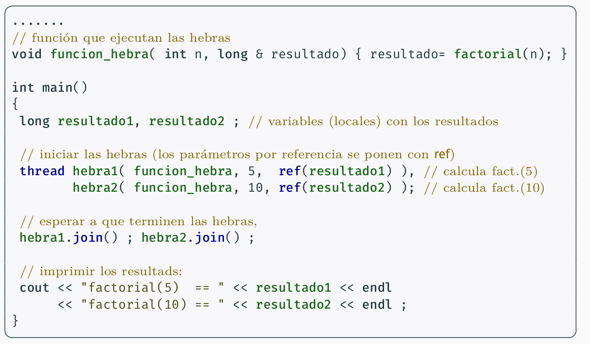

##### Uso de la función `async`:

La función que ejecuta la hebra devuelve el resultado de la forma usual, mediante una sentencia `return`. La hebra se pone en marcha con una llamada a la función `async`, se especifica: el *modo*, el nombre de la función que ejecuta la hebra y sus parámetros, si los hay. El *modo* es una constante que indica que la función se debe ejecutar mediante una hebra concurrente específica para ello. 

La llamada a `async` devuelve una variable (u objeto) de tipo *futuro* (`future`), ligada a la hebra que se pone en marcha. Esta clase incorpora un método (`get`) para esperar a que termine la hebra y leer el resultado calculado.

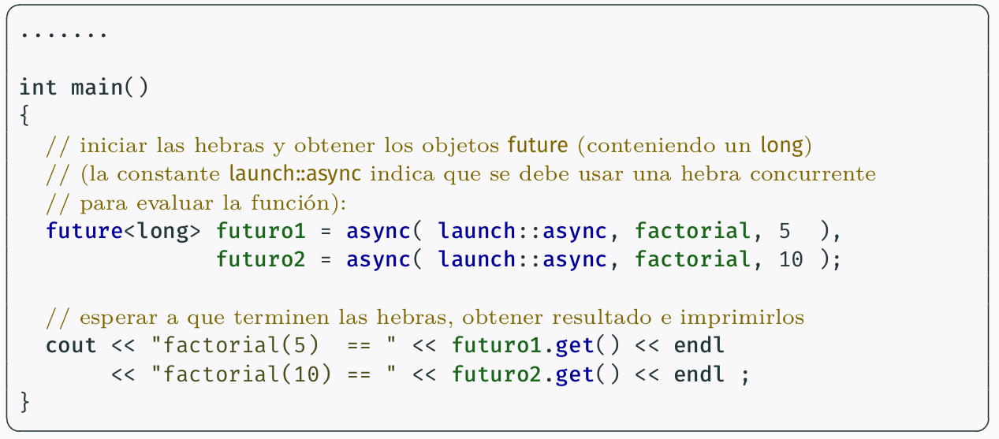

#### Ejemplo de un vector de hebras

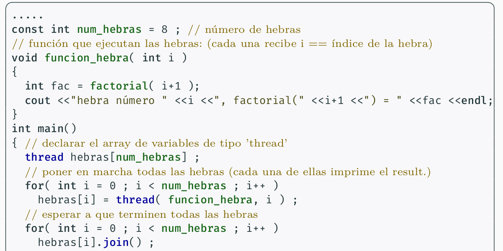
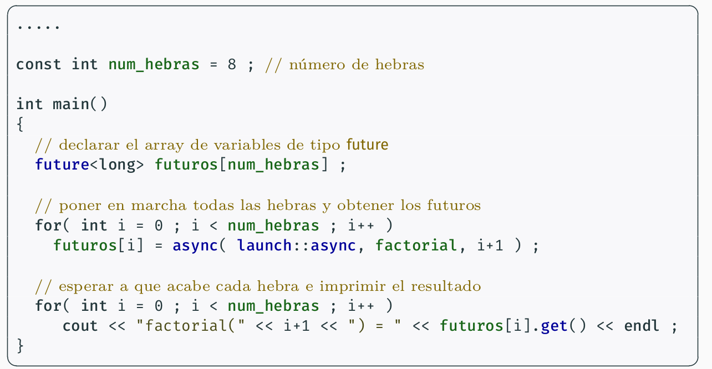

#### Medición de tiempos con el reloj monotónico

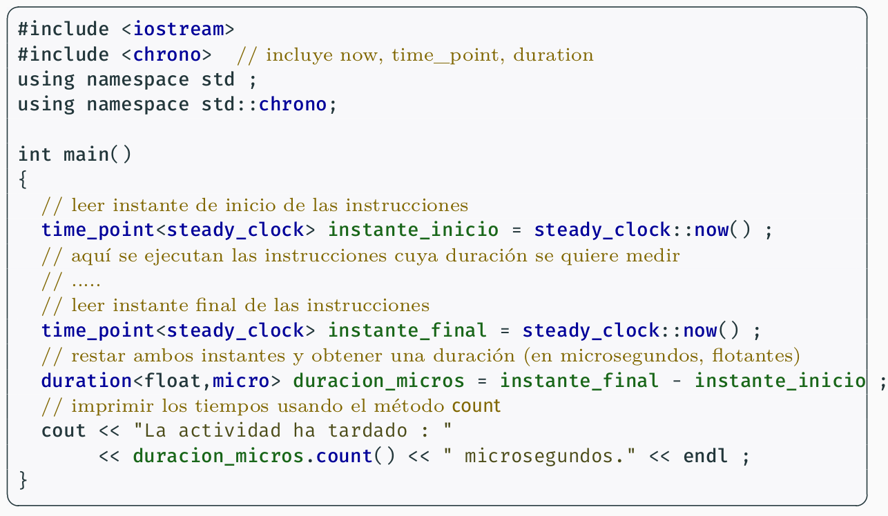

#### Sincronización básica en C++11

Veremos algunas de las posibilidades básicas que ofrece C++11 para la sincronización de hebras. Son estas dos:

* `Tipos atómicos`: tipos de datos (típicamente enteros) cuyas variables se pueden actualizar de *forma atómica*, es decir, en exclusión mutua.
    * Para cada tipo entero posible (char, int, long, unsigned, etc) existe un correspondiente tipo atómico, llamado `atomic<T>` o bien `atomic_T` (donde `T` es el tipo entero original).
    * Si `k` es una de estas variables, las siguientes operaciones se hacen de forma atómica:
        * Asignación de un valor: `k=expresion;`
        * Incrementos o decrementos de la forma: `k++;` `k--` `k+=expresion;` `k-=expresion;` (si la `expresion` no es un simple literal, su evaluación previa no ocurre atómicamente junto con la actualización).

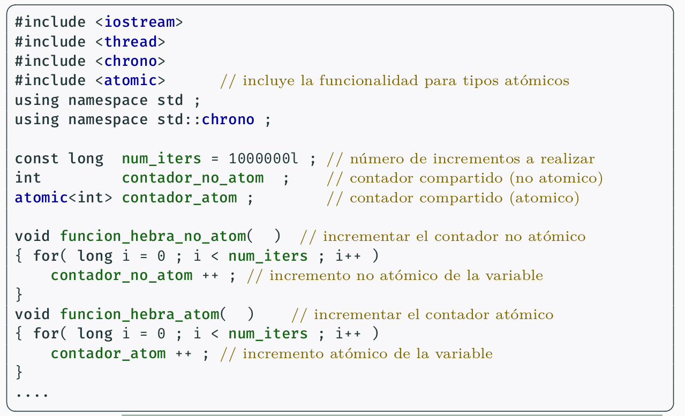
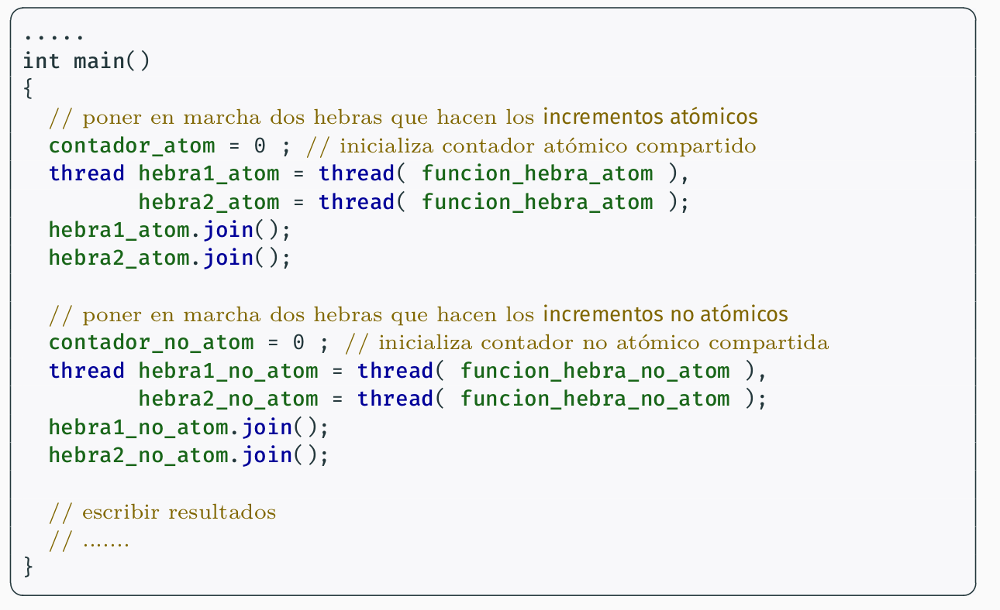

* `Objetos mutex`: son variables (objetos) que incluyen operaciones que permiten garantizar la exclusión mutua en la ejecución de trozos de código (secciones críticas). (También llamados cerrojos `locks`).
    * Las dos únicas operacines que se pueden hacer sobre un objeto tipo mutex  (`std::mutex`) son `lock` y `unlock`.
        * `lock`: se invoca el inicio de la sección crítica, y la hebra espera si ya hay otra ejecutando dicha SC. Si ocurre la espera, la hebra no ocupa la CPU durante la misma (queda bloqueada).
        * `unlock`: se invoca al final de la SC para indicar que ha terminado de ejecutar dicha SC, de forma que otras hebras puedan comenzar su ejecución.
    * Entre las operaciones `lock` y `unlock`, decimos que la hebra *tiene adquirido o posee* el mutex. Un mutex está libre o adquirido por una única hebra.

#### Semáforos

Los semáforos constituyen un mecanismo de nivel medio que permite solucionar los problemas derivados de la ejecución concurrente de procesos no independientes.

Un semáforo es una instancia de una estructura de datos (un registro) que contiene los siguientes elementos:

* Un conjunto de procesos bloqueados (se dice que están esperando en el semáforo).
* Un valor natural (entero no negativo), al que llamaremos *valor del semáforo*.

Estas estructuras de datos residen en memoria compartida.

Además de la inicialización, solo hay dos operaciones básicas que se pueden realizar sobre una variable de tipo semáforo (que llamaremos *s*):

* `sem_wait(s)`: si el valor de *s* es cero, espera a que el valor sea mayor que cero (durante la espera, el proceso se añade a la lista de procesos bloqueados del semáforo). Luego, decremente la variable *s* en una unidad.
* `sem_signal(s)`: incrementa el valor de *s* en una unidad. Si hay procesos esperando en la lista de procesos de *s*, permite que uno de ellos salga de la espera y continue la ejecución (ese proceso decrementará el valor del semáforo).

#### Patrones de solución de problemas de sincronización

##### Espera única:

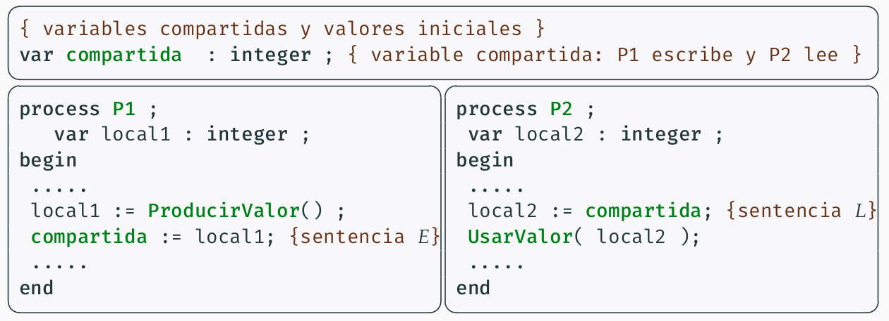

Este programa no funciona correctamente.

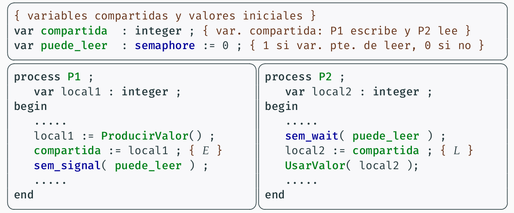

##### Exclusión mutua:

En este caso, queremos que en cada instante de tiempo solo haya un proceso como mucho ejecutando un trozo de código que llamamos sección crítica.

Este programa no funciona correctamente.

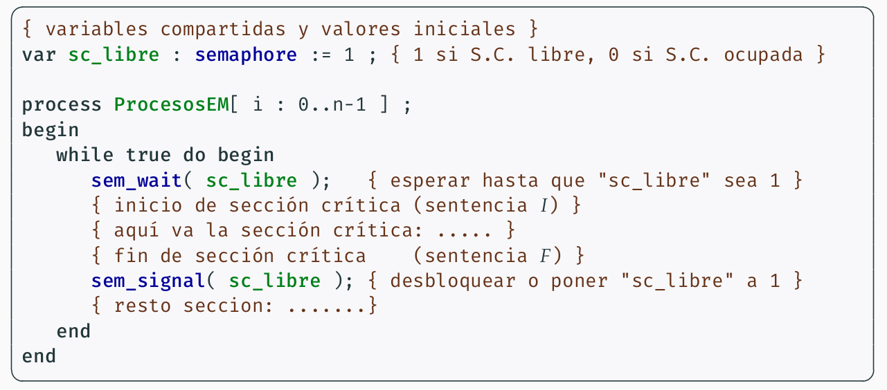

##### Productor-Consumidor (lectura/escritura repetidas)

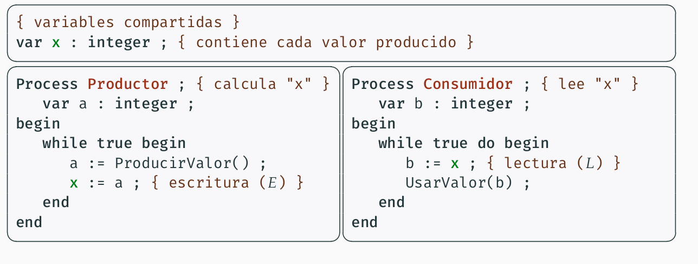
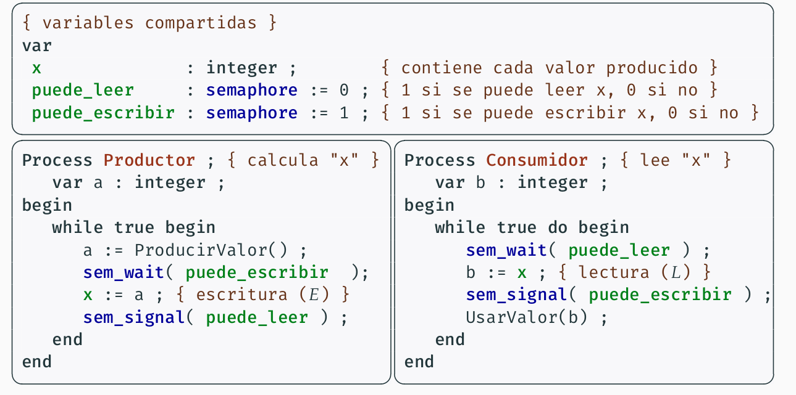

#### Operaciones y compilación con Semáforos.

El estándar *C++11* no comtenpla funcionalidad alguna para semáforos. Sin embargo, se ha diseñado un tipo de datos (una clase) que ofrezca dicha funcionalidad, usando otras características de *C++11*: `Semaphore`.

~~~C++
Semaphore s1 = 34, s2 = 0;
Semaphore s3( 34 ), s4( 5 );

sem_wait( s1 ); s1.sem_wait();
sem_signal( s1 ); s1.sem_signal();
~~~

El orden de asignación de CPU a las hebras que esperan es una cola (**FIFO**).

###### Consideraciones

* Los programas que usan semáforos típicamente declaran variables globales de tipo `Semaphore` compartidas entre las hebras que los usan.
* Es necesario hacer `#include` y `using` en la cabecera:

* Se debe de disponer de los archivos `Semaphore.h` y `Semaphore.cpp` en el directorio de trabajo.
* Se debe compilar y enlazar el archivo `Semaphore.cpp` junto con los fuentes que usan los semáforos.

##### Ejemplo resuelto de implementación Productor-Consumidor

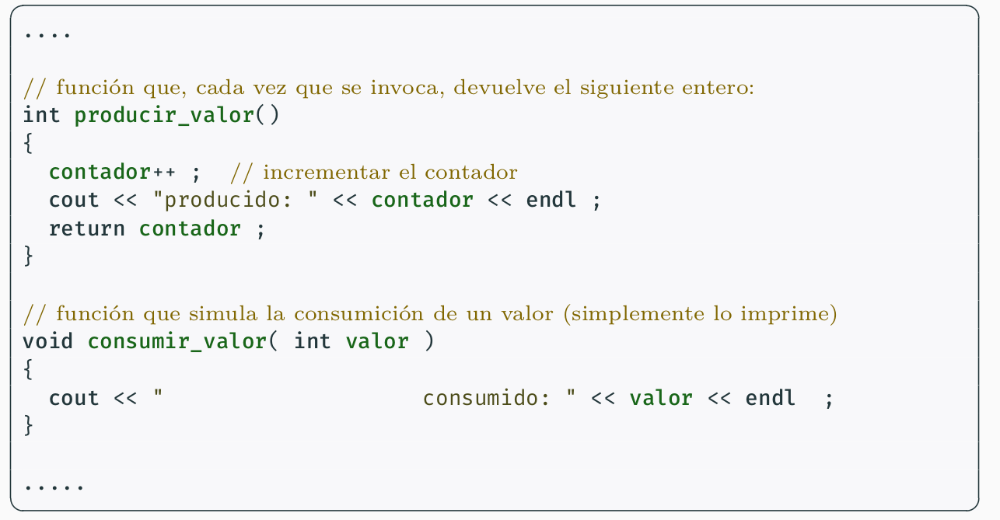
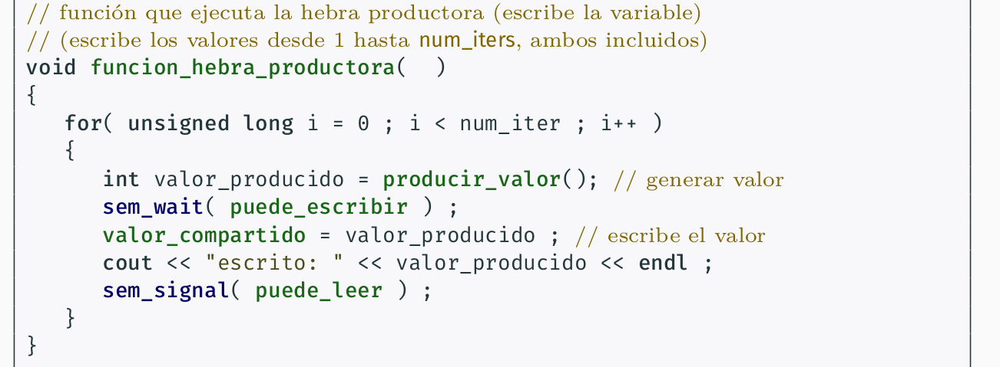

